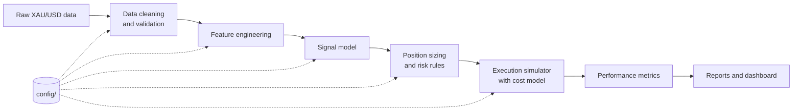
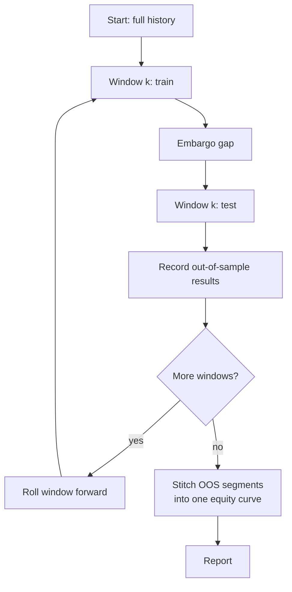

<!--
=====================================================================
  README TEMPLATE FOR TRGF-XAU  -  READ BEFORE PUBLISHING
=====================================================================
  I could only see this repo's folder layout, not its code. Every
  place where the text depends on what YOUR code actually does is
  marked:   <<FILL: ...>>
  Search the file for "<<FILL" and replace each one. Delete this
  comment block when finished.

  RULE: never publish a performance number you did not produce by
  running your own backtest. All result tables below are "TBD".
=====================================================================
-->

<div align="center">

# TRGF-XAU

### <<FILL: one-line tagline, e.g. "A walk-forward research and backtesting framework for XAU/USD (gold)">>

**TRGF** = <<FILL: expansion of the acronym>>

[](https://www.python.org/)
[](#project-status)
[](#testing)
[](https://github.com/astral-sh/ruff)
[](#license)

[Overview](#overview) · [Results](#headline-results) · [Quick start](#quick-start) · [Methodology](#methodology) · [Limitations](#limitations-and-honest-caveats) · [FAQ](#faq)

</div>

---

## Table of Contents

1. [Overview](#overview)
2. [Headline Results](#headline-results)
3. [Why Gold?](#why-gold)
4. [Research Question and Hypothesis](#research-question-and-hypothesis)
5. [Key Features](#key-features)
6. [System Architecture](#system-architecture)
7. [Repository Structure](#repository-structure)
8. [Installation](#installation)
9. [Configuration](#configuration)
10. [Data](#data)
11. [Quick Start](#quick-start)
12. [Usage Guide](#usage-guide)
13. [Dashboard (Frontend)](#dashboard-frontend)
14. [Methodology](#methodology)
15. [Feature Engineering](#feature-engineering)
16. [Signal Generation](#signal-generation)
17. [Position Sizing and Risk Management](#position-sizing-and-risk-management)
18. [Execution and Transaction Cost Model](#execution-and-transaction-cost-model)
19. [Backtest Engine](#backtest-engine)
20. [Validation Protocol](#validation-protocol)
21. [Bias Controls](#bias-controls)
22. [Performance Metrics](#performance-metrics)
23. [Statistical Significance](#statistical-significance)
24. [Detailed Results](#detailed-results)
25. [Robustness and Sensitivity](#robustness-and-sensitivity)
26. [Ablation Study](#ablation-study)
27. [Limitations and Honest Caveats](#limitations-and-honest-caveats)
28. [Testing](#testing)
29. [Reproducibility](#reproducibility)
30. [Project Status](#project-status)
31. [Roadmap](#roadmap)
32. [Contributing](#contributing)
33. [FAQ](#faq)
34. [Glossary](#glossary)
35. [References](#references)
36. [Disclaimer](#disclaimer)
37. [License](#license)
38. [Author](#author)

---

## Overview

**TRGF-XAU** is a quantitative research codebase for **XAU/USD** (spot gold priced in US dollars).
It takes raw price data through a reproducible pipeline:

```
raw data -> cleaning -> features -> signal -> position sizing -> simulated execution -> metrics -> report
```

<<FILL: 3-5 sentences. What does TRGF actually do? Is it a trading strategy, a regime
filter, a forecasting model, or a framework? What is the core idea in plain language?>>

The project is built around three principles:

1. **Honest evaluation.** Every reported number comes from out-of-sample data, after
   transaction costs, produced by walk-forward validation. No in-sample results are
   presented as performance.
2. **Reproducibility.** One configuration file plus one command regenerates every
   table and figure in this README.
3. **Engineering discipline.** Typed configuration, unit-tested components, and a clear
   separation between data, signal logic, and the backtest engine.

> **Who is this for?** Students, researchers, and engineers who want a clean, readable
> reference for how a systematic strategy should be tested, and reviewers who want to
> check the methodology rather than trust a headline number.

---

## Headline Results

> All numbers below are **out-of-sample**, **net of costs**, and generated by
> `<<FILL: command that reproduces them>>`.
> They are placeholders until you run your own backtest. **Do not publish invented numbers.**

| Metric                         | TRGF-XAU | Buy & Hold XAU | Notes                      |
| ------------------------------ | -------- | -------------- | -------------------------- |
| Test period                    | TBD      | TBD            | <<FILL: dates>>            |
| Annualized return (CAGR)       | TBD      | TBD            |                            |
| Annualized volatility          | TBD      | TBD            |                            |
| Sharpe ratio                   | TBD      | TBD            | rf = <<FILL: 0 or T-bill>> |
| Sortino ratio                  | TBD      | TBD            |                            |
| Maximum drawdown               | TBD      | TBD            |                            |
| Calmar ratio                   | TBD      | TBD            |                            |
| Win rate                       | TBD      | n/a            |                            |
| Profit factor                  | TBD      | n/a            |                            |
| Average trades per year        | TBD      | n/a            |                            |
| Annualized turnover            | TBD      | n/a            |                            |
| Deflated Sharpe ratio (p)      | TBD      | n/a            | see [significance](#statistical-significance) |

### Equity curve

<!-- Replace with your real figure. Keep the path stable so the README never breaks. -->


*Figure 1. Out-of-sample equity curve of TRGF-XAU versus buy-and-hold, net of costs.*

### Drawdown profile


*Figure 2. Underwater plot. Depth and duration of drawdowns matter more than the final return.*

### How to read these results

- A high Sharpe on a short sample is weak evidence. Look at the confidence interval and
  the number of independent trades.
- Compare against **buy and hold**, not against zero. Gold has had long strong trends, and
  a strategy that is simply "long gold" will look good in those periods.
- Check the **cost sensitivity** table before believing any result. See
  [Robustness and Sensitivity](#robustness-and-sensitivity).

---

## Why Gold?

Gold is a useful but difficult research subject.

| Property                  | Why it matters                                                              |
| ------------------------- | --------------------------------------------------------------------------- |
| Deep, liquid market       | Realistic fills for modest size, tight spreads in main sessions             |
| Near 24-hour trading      | Session structure (Asia, London, New York) creates intraday seasonality     |
| Macro-driven              | Reacts to real yields, the US dollar, inflation expectations, and risk-off  |
| Regime-dependent          | Behaves differently in trending, mean-reverting, and crisis regimes         |
| Heavy tails               | Event risk (central banks, geopolitics) breaks naive volatility assumptions |
| Low correlation to equity | Potential diversifier, which makes a standalone signal interesting          |

The same properties make it easy to **fool yourself**. A strategy tuned on one gold bull run
can look excellent and fail immediately afterwards. This project is designed around that risk.

---

## Research Question and Hypothesis

**Research question**

> <<FILL: e.g. "Does a <<signal family>> contain information about future XAU/USD returns
> that survives realistic costs and out-of-sample testing?">>

**Hypothesis (H1)**

> <<FILL: state the economic or behavioural reason the edge should exist.
> Example: "Trend persistence in gold is driven by slow-moving macro flows, so
> volatility-scaled momentum should earn a positive risk premium.">>

**Null hypothesis (H0)**

> The strategy's out-of-sample risk-adjusted return is indistinguishable from zero after
> accounting for costs and for the number of strategy variants tried.

**What would falsify H1?**

- Out-of-sample Sharpe not significantly above zero after the deflation adjustment.
- Performance that disappears when transaction costs rise by a plausible margin.
- Performance that exists only in a single sub-period or a single parameter setting.

A project that states how it could be wrong is more credible than one that only reports wins.

---

## Key Features

- **Reproducible pipeline** driven by a single typed configuration in `config/`.
- **Walk-forward validation** with an explicit embargo between train and test windows.
- **Realistic cost model**: spread, slippage, commission, and optional overnight financing.
- **Volatility-targeted position sizing** with leverage and exposure caps.
- **Risk controls**: stop logic, daily loss limits, and maximum drawdown circuit breaker.
- **Full metrics suite** including Sharpe, Sortino, Calmar, drawdown statistics, and tail risk.
- **Statistical tests**: bootstrap confidence intervals and a deflated Sharpe ratio.
- **Automated reports** written to `reports/` (figures, tables, run metadata).
- **Interactive dashboard** in `frontend/` for exploring runs. <<FILL: confirm what it shows>>
- **Test suite** in `tests/` covering data handling, features, and the backtest engine.
- **Windows task runner** (`tasks.ps1`) for common commands.

<<FILL: remove any feature above that the code does not actually implement.
A shorter honest list beats a long inflated one.>>

---

## System Architecture

### High-level pipeline



### Walk-forward loop



### Design decisions

| Decision                             | Reason                                                                |
| ------------------------------------ | --------------------------------------------------------------------- |
| Separate signal from sizing          | Lets you test the signal alone, then add risk rules, and see the delta |
| Config-driven, not hard-coded        | Any result can be re-run from a saved config                          |
| Next-bar execution                   | Signals computed on bar *t* are executed on bar *t+1* to avoid look-ahead |
| Costs applied inside the engine      | No result is ever shown gross of costs by accident                    |
| Out-of-sample only in headline table | In-sample numbers are diagnostics, not evidence                       |

---

## Repository Structure

<<FILL: run `tree -L 3 -I "__pycache__|.git|node_modules"` (or `tree /F` on Windows) and
paste the real layout here. The block below is based on the top-level folders I could see.>>

```
TRGF-XAU/
├── config/                 # YAML/TOML configuration: data, features, strategy, costs, risk
├── frontend/               # Dashboard for exploring results
├── reports/                # Generated figures, tables, and run summaries
│   └── figures/
├── scripts/                # Entry-point scripts: download data, run backtest, build report
├── src/                    # Library code
│   └── <<FILL: package name>>/
│       ├── data/           # Loading, cleaning, validation
│       ├── features/       # Feature engineering
│       ├── signals/        # Signal generation
│       ├── risk/           # Position sizing and risk rules
│       ├── backtest/       # Execution simulator and cost model
│       ├── metrics/        # Performance and statistical tests
│       └── utils/
├── tests/                  # Unit and integration tests
├── .env.example            # Template for environment variables (never commit .env)
├── .gitignore
├── pyproject.toml          # Package metadata and tool configuration
├── requirements.txt        # Pinned dependencies
├── tasks.ps1               # PowerShell task runner (Windows)
└── README.md
```

### What lives where

| Folder      | Responsibility                                                    | Touch it when...                  |
| ----------- | ----------------------------------------------------------------- | --------------------------------- |
| `config/`   | Every tunable parameter                                           | You want a new experiment         |
| `src/`      | Reusable logic, no side effects at import time                    | You change how something is computed |
| `scripts/`  | Thin command-line wrappers around `src/`                          | You add a new workflow            |
| `reports/`  | Output only. Safe to delete and regenerate                        | Never edit by hand                |
| `tests/`    | Correctness checks                                                | You change any logic in `src/`    |
| `frontend/` | Visualization layer                                               | You change how results are shown  |

---

## Installation

### Requirements

- Python **3.10 or newer** <<FILL: confirm against pyproject.toml>>
- Git
- (Optional) Node.js 18+ for the dashboard in `frontend/` <<FILL: confirm>>
- Windows PowerShell 5.1+ or PowerShell 7 for `tasks.ps1`; any shell works for the raw commands

### Step 1. Clone

```bash
git clone https://github.com/mayurpatil10001/TRGF-XAU.git
cd TRGF-XAU
```

### Step 2. Create a virtual environment

```powershell
# Windows (PowerShell)
python -m venv .venv
.\.venv\Scripts\Activate.ps1
```

```bash
# macOS / Linux
python3 -m venv .venv
source .venv/bin/activate
```

### Step 3. Install dependencies

```bash
pip install --upgrade pip
pip install -r requirements.txt
```

Or install the package in editable mode so `src/` is importable everywhere:

```bash
pip install -e .
```

### Step 4. Set up environment variables

```bash
cp .env.example .env        # macOS / Linux
copy .env.example .env      # Windows
```

Then edit `.env`. **Never commit `.env`.** It is already listed in `.gitignore`; verify with:

```bash
git check-ignore .env
```

### Step 5. Verify the install

```bash
pytest -q
```

If all tests pass, the environment is correct.

### Troubleshooting

| Symptom                                   | Likely cause                      | Fix                                                |
| ----------------------------------------- | --------------------------------- | -------------------------------------------------- |
| `ModuleNotFoundError: <<FILL: package>>`  | Package not installed             | Run `pip install -e .`                             |
| `Activate.ps1 cannot be loaded`           | PowerShell execution policy       | `Set-ExecutionPolicy -Scope CurrentUser RemoteSigned` |
| Tests fail on import                      | Wrong Python version              | Check `python --version`                           |
| Data download fails                       | Missing or invalid API key        | Check `.env`, see [Data](#data)                    |
| Plots do not render                       | Headless environment              | Set `MPLBACKEND=Agg`                               |

---

## Configuration

All experiments are controlled from `config/`. Nothing important is hard-coded in `src/`.

<<FILL: list the real config files. Example layout shown below.>>

```
config/
├── data.yaml          # source, symbol, timeframe, date range
├── features.yaml      # which features, lookback windows
├── strategy.yaml      # signal parameters, thresholds
├── risk.yaml          # volatility target, leverage cap, stops
├── costs.yaml         # spread, slippage, commission, financing
└── validation.yaml    # walk-forward window sizes, embargo
```

### Example `strategy.yaml`

```yaml
# <<FILL: replace with your real parameters>>
strategy:
  name: trgf
  lookback_fast: 20        # bars
  lookback_slow: 100       # bars
  entry_threshold: 0.5     # signal z-score to open a position
  exit_threshold: 0.1      # signal z-score to close a position
  allow_short: true
```

### Example `risk.yaml`

```yaml
risk:
  target_annual_vol: 0.10  # 10% annualized volatility target
  max_leverage: 3.0
  vol_lookback: 60         # bars used to estimate volatility
  stop_loss_atr_mult: 3.0
  daily_loss_limit: 0.02   # stop trading for the day after -2%
  max_drawdown_halt: 0.20  # flatten and halt at -20% from peak
```

### Example `costs.yaml`

```yaml
costs:
  spread_usd: 0.30         # per ounce, round trip, <<FILL: justify from your broker/data>>
  slippage_bps: 0.5        # on each fill
  commission_bps: 0.0
  financing_bps_per_day: 0.0
```

### Example `validation.yaml`

```yaml
validation:
  scheme: walk_forward
  train_years: 5
  test_months: 6
  step_months: 6
  embargo_days: 5          # gap between train end and test start
  refit_each_window: true
```

### Environment variables

| Variable             | Required | Description                                  |
| -------------------- | -------- | -------------------------------------------- |
| `<<FILL: DATA_API_KEY>>` | If using a remote source | API key for the market data provider |
| `TRGF_DATA_DIR`      | No       | Where raw and processed data are stored      |
| `TRGF_REPORT_DIR`    | No       | Output folder for reports (default `reports/`) |
| `TRGF_LOG_LEVEL`     | No       | `DEBUG`, `INFO`, `WARNING` (default `INFO`)  |

<<FILL: match this table to your real .env.example>>

### Configuration philosophy

- **One experiment = one config snapshot.** Each run saves a copy of the resolved config
  next to its outputs, so any result can be reproduced exactly.
- **No magic numbers in code.** If a number affects results, it belongs in `config/`.
- **Defaults are conservative.** Costs default to realistic, not zero.

---

## Data

### Source

| Item              | Value                                           |
| ----------------- | ----------------------------------------------- |
| Instrument        | XAU/USD spot gold                               |
| Provider          | <<FILL: e.g. Dukascopy, OANDA, yfinance GC=F, broker export>> |
| Timeframe         | <<FILL: e.g. 1-hour bars>>                      |
| History used      | <<FILL: start date to end date>>                |
| Timezone          | <<FILL: UTC recommended>>                       |
| Price type        | <<FILL: bid, ask, or mid>>                      |

### Download

```bash
python scripts/<<FILL: download_data.py>> --config config/data.yaml
```

### Expected schema

| Column      | Type      | Description                         |
| ----------- | --------- | ----------------------------------- |
| `timestamp` | datetime  | Bar open time, timezone-aware (UTC) |
| `open`      | float     | Opening price                       |
| `high`      | float     | Highest price in the bar            |
| `low`       | float     | Lowest price in the bar             |
| `close`     | float     | Closing price                       |
| `volume`    | float     | Tick volume (spot FX volume is a proxy only) |

### Data quality checks

Every load runs these checks and fails loudly rather than silently continuing:

- [x] Timestamps strictly increasing, no duplicates
- [x] No bars with `high < low` or prices outside `[low, high]`
- [x] No non-positive prices
- [x] Gaps flagged (weekends are expected; unexpected gaps are logged)
- [x] Outlier bars flagged by a robust z-score on returns
- [x] Timezone normalised to UTC

<<FILL: only keep checks your code actually performs.>>

### Known data issues for spot gold

- **No single official price.** Spot gold is OTC. Different providers show slightly
  different prices, so results on one feed may not match another.
- **Tick volume is not traded volume.** Do not read it as real liquidity.
- **Weekend gaps.** Monday opens can gap on weekend news. The backtest treats gaps as real
  risk and does not assume you can exit inside a gap.
- **Rollover and holidays.** Thin liquidity around 21:00 UTC and bank holidays widens spreads.
- **Survivorship does not apply**, but **regime change does**: the 2008, 2011, 2020 and
  later gold moves are very different from the sideways periods between them.

### Data licensing

Raw data is **not** committed to this repository because most providers forbid
redistribution. Use the download script to fetch your own copy.

---

## Quick Start

The shortest path from clone to results:

```bash
# 1. get data
python scripts/<<FILL: download_data.py>>

# 2. run the full walk-forward backtest
python scripts/<<FILL: run_backtest.py>> --config config/strategy.yaml

# 3. build the report (figures + tables)
python scripts/<<FILL: make_report.py>>

# 4. open reports/
```

### Using the Windows task runner

```powershell
.\tasks.ps1 <<FILL: setup>>       # create venv and install dependencies
.\tasks.ps1 <<FILL: test>>        # run the test suite
.\tasks.ps1 <<FILL: backtest>>    # run the walk-forward backtest
.\tasks.ps1 <<FILL: report>>      # generate figures and tables
```

<<FILL: open tasks.ps1 and list the real task names. Delete this block if they differ.>>

### Minimal Python example

```python
# <<FILL: adjust imports to your real package and function names>>
from trgf_xau.config import load_config
from trgf_xau.data import load_prices
from trgf_xau.backtest import run_walk_forward

cfg = load_config("config/strategy.yaml")
prices = load_prices(cfg.data)

result = run_walk_forward(prices, cfg)

print(result.summary())          # table of metrics
result.plot_equity()             # equity curve
result.save("reports/run_001")   # figures, tables, config snapshot
```

---

## Usage Guide

### Run a single experiment

```bash
python scripts/<<FILL: run_backtest.py>> \
    --config config/strategy.yaml \
    --risk config/risk.yaml \
    --costs config/costs.yaml \
    --out reports/run_001
```

### Compare two configurations

```bash
python scripts/<<FILL: compare_runs.py>> reports/run_001 reports/run_002
```

### Run a parameter sweep

```bash
python scripts/<<FILL: sweep.py>> --grid config/sweep.yaml
```

> **Warning.** Every parameter combination you try increases the chance that the best one
> is luck. Record the **total number of trials** and feed it into the
> [deflated Sharpe ratio](#statistical-significance).

### Run only a slice of history

```bash
python scripts/<<FILL: run_backtest.py>> --start 2018-01-01 --end 2023-12-31
```

### Output of a run

```
reports/run_001/
├── config_snapshot.yaml    # exact configuration used
├── metrics.json            # all performance numbers
├── trades.csv              # one row per trade
├── equity.csv              # equity per bar
├── figures/
│   ├── equity_curve.png
│   ├── drawdown.png
│   ├── monthly_returns.png
│   └── rolling_sharpe.png
└── run_info.json           # git commit, package versions, random seed, timestamp
```

---

## Dashboard (Frontend)

The `frontend/` folder contains an interactive viewer for completed runs.
<<FILL: confirm the framework (React, Next.js, Streamlit, plain HTML) and what it shows.>>

```bash
cd frontend
npm install
npm run dev
# open http://localhost:3000
```

| Page            | Shows                                                    |
| --------------- | -------------------------------------------------------- |
| Overview        | Headline metrics and equity curve                        |
| Trades          | Trade list with entry, exit, PnL, holding time           |
| Risk            | Drawdown, rolling volatility, exposure over time         |
| Regimes         | Performance split by market regime                       |
| Compare         | Side-by-side runs                                        |

<<FILL: edit this table to match the real pages, or delete the section if the frontend is minimal.>>

The dashboard reads results from `reports/`. It never changes strategy logic.

---

## Methodology

This section explains **how** results are produced so a reviewer can judge them without
reading the code first.

### Pipeline summary

| Stage | Input                | Output                   | Leakage risk                          |
| ----- | -------------------- | ------------------------ | ------------------------------------- |
| 1     | Raw bars             | Clean bars               | None                                  |
| 2     | Clean bars           | Feature matrix           | Rolling windows must use past data only |
| 3     | Features             | Signal in [-1, 1]        | Parameters fit on train window only   |
| 4     | Signal               | Target position          | Volatility estimated from past only   |
| 5     | Target position      | Fills, cash, PnL         | Execute on next bar, never same bar   |
| 6     | PnL series           | Metrics, tests, report   | None                                  |

### Timing convention

All decisions follow one rule:

> Information available at the **close of bar t** may only influence the position held
> during **bar t+1**.

```
bar t close  ->  compute features  ->  compute signal  ->  order placed
bar t+1 open ->  order filled at open +/- spread and slippage
bar t+1      ->  PnL accrues on the new position
```

This removes the most common backtest error: trading on a price you could not have known.

---

## Feature Engineering

<<FILL: replace the table with your real features. Remove anything you do not compute.>>

### Feature families

| Family          | Examples                                              | Intuition                         |
| --------------- | ----------------------------------------------------- | --------------------------------- |
| Trend           | Moving-average spread, rate of change, breakout distance | Persistence of macro-driven moves |
| Mean reversion  | Z-score of price vs rolling mean, RSI                 | Short-term overextension          |
| Volatility      | ATR, realized volatility, volatility-of-volatility    | Risk state and regime             |
| Seasonality     | Hour of day, session (Asia / London / New York)       | Intraday liquidity structure      |
| Cross-asset     | <<FILL: DXY, US yields, real yields, if used>>        | Gold's macro drivers              |
| Calendar        | Days to FOMC, NFP, CPI <<FILL: if used>>              | Event risk                        |

### Rules for every feature

1. **Past-only.** A feature at time *t* uses data up to and including *t*, nothing later.
2. **Stationary where possible.** Prefer returns, ratios, and z-scores over raw price levels.
3. **Scaled on the training window.** Means and standard deviations used for scaling are
   computed on training data only and then applied unchanged to the test window.
4. **Documented.** Each feature has a docstring stating its formula and lookback.

### Example: volatility-scaled momentum

```
r_t        = ln(P_t / P_{t-1})
mom_t      = sum(r_{t-k+1} ... r_t)              # k-bar cumulative return
sigma_t    = std(r_{t-n+1} ... r_t)              # n-bar realized volatility
signal_t   = mom_t / (sigma_t * sqrt(k))         # volatility-scaled momentum
```

### Feature diagnostics

Before any model is fit, the pipeline reports:

- Correlation matrix, to catch redundant features
- Information coefficient (rank correlation of feature with next-bar return) per window
- Stability of that coefficient across walk-forward windows
- Missing-value counts after warm-up

A feature whose information coefficient changes sign across windows is a warning sign,
not an asset.

---

## Signal Generation

<<FILL: describe the actual TRGF signal in 1-3 paragraphs. This is the most important
section of the README. Explain: inputs, the decision rule or model, and the output.>>

### Signal definition

```
signal_t  in  [-1, +1]
   +1  : maximum conviction long
    0  : flat
   -1  : maximum conviction short
```

### Decision rule

<<FILL: e.g. threshold rule, regime switch, ML classifier, ensemble. Include the equation.>>

```
if signal_t >  entry_threshold :  target = +1
if signal_t < -entry_threshold :  target = -1
if |signal_t| < exit_threshold :  target =  0
else                           :  keep previous target   # hysteresis reduces churn
```

### Why hysteresis?

Using different entry and exit thresholds stops the strategy from flipping position every
time the signal wobbles around a single cut-off. That reduces turnover and therefore costs.

### Model fitting (if applicable)

| Item                     | Value                                          |
| ------------------------ | ---------------------------------------------- |
| Model type               | <<FILL: rules / logistic / gradient boosting / HMM / other>> |
| Target variable          | <<FILL: next-bar return sign, next-N-bar return, regime label>> |
| Fitted on                | Training window only                           |
| Hyperparameter selection | <<FILL: nested validation inside the training window>> |
| Refit frequency          | Every walk-forward window                      |
| Random seed              | Fixed in config, saved in `run_info.json`      |

---

## Position Sizing and Risk Management

### Volatility targeting

Position size is scaled so the strategy aims for a constant risk level, not a constant
number of ounces:

```
leverage_t = min( target_vol / sigma_t_annualized , max_leverage )
position_t = target_direction_t * leverage_t * equity_t / price_t
```

Why this matters: gold's volatility changes a lot. Fixed size means huge risk in calm-to-wild
transitions and wasted capital in quiet periods.

### Risk rules

| Rule                        | Purpose                                         | Config key             |
| --------------------------- | ----------------------------------------------- | ---------------------- |
| Leverage cap                | Limits exposure when volatility is very low     | `max_leverage`         |
| ATR stop-loss               | Caps loss on a single trade                     | `stop_loss_atr_mult`   |
| Daily loss limit            | Stops trading after a bad day                   | `daily_loss_limit`     |
| Max drawdown halt           | Flattens and pauses at a set drawdown           | `max_drawdown_halt`    |
| Weekend flat <<FILL: if used>> | Avoids weekend gap risk                      | `flat_before_weekend`  |
| Event blackout <<FILL: if used>> | No new trades around major releases        | `event_blackout_min`   |

### Important caveat on stops

Stops in a backtest are optimistic. In real gold trading, a stop can fill **far worse than
its level** during a gap or a news spike. This engine fills stops at the **next available
price**, not at the stop level, to avoid flattering results. See
[Limitations](#limitations-and-honest-caveats).

---

## Execution and Transaction Cost Model

Costs are the most common reason a good-looking backtest fails in live trading.
They are modelled explicitly and are **always on**.

### Components

| Component  | Model                                              | Typical gold range        |
| ---------- | -------------------------------------------------- | ------------------------- |
| Spread     | Half the quoted spread paid on each side           | <<FILL: from your data>>  |
| Slippage   | Fixed bps plus a volatility-scaled term            | <<FILL>>                  |
| Commission | Per-lot or bps of notional                         | <<FILL: broker specific>> |
| Financing  | Daily swap on positions held overnight             | <<FILL: broker specific>> |

### Fill logic

```
buy  fill price = open_{t+1} + half_spread + slippage
sell fill price = open_{t+1} - half_spread - slippage
```

### Cost drag

The report shows **gross return, total costs, and net return** so you can see exactly how
much edge is eaten by trading. If costs consume most of the gross return, the strategy is
trading too often for its edge.

| Quantity               | Value |
| ---------------------- | ----- |
| Gross annual return    | TBD   |
| Annual cost drag       | TBD   |
| Net annual return      | TBD   |
| Cost as % of gross     | TBD   |
| Break-even spread      | TBD   |

---

## Backtest Engine

### Design

The engine is **event-ordered and bar-based**:

1. Process the next bar.
2. Fill any orders created on the previous bar.
3. Update positions, cash, and mark-to-market equity.
4. Apply risk rules (stops, limits, halts).
5. Compute features and signal from the bar that just closed.
6. Create orders for the next bar.

### Guarantees

- No future data is accessible to the signal at any step.
- Equity is marked to market every bar, so drawdown is not understated by only
  looking at closed trades.
- Every trade is logged with entry time, exit time, direction, size, costs, and PnL.
- The same inputs and seed always produce identical outputs.

### Position accounting

```
equity_t = equity_{t-1} + position_{t-1} * (P_t - P_{t-1}) - costs_t
```

### Assumptions to be aware of

| Assumption                         | Realism                                       |
| ---------------------------------- | --------------------------------------------- |
| Fills always happen at next open   | Reasonable for liquid sessions, weak at news  |
| No market impact                   | Fine for small size, not for institutional    |
| Constant spread within a session   | Simplification, real spreads widen at rollover |
| Unlimited short availability       | True for spot gold, check your broker         |
| Instant fills, no rejections       | Optimistic                                    |

---

## Validation Protocol

### Walk-forward analysis

The history is split into rolling train and test windows. The model is fit on each train
window and evaluated on the following test window. Test windows are then stitched together
into one continuous out-of-sample equity curve.

```
Window 1: [==== train ====][embargo][== test ==]
Window 2:      [==== train ====][embargo][== test ==]
Window 3:           [==== train ====][embargo][== test ==]
                                                  ^
                              only these segments appear in headline results
```

| Parameter    | Value | Why                                                   |
| ------------ | ----- | ----------------------------------------------------- |
| Train length | <<FILL: e.g. 5 years>> | Enough to cover more than one regime        |
| Test length  | <<FILL: e.g. 6 months>>| Short enough to adapt, long enough to measure |
| Step         | <<FILL: e.g. 6 months>>| Non-overlapping test windows                  |
| Embargo      | <<FILL: e.g. 5 days>>  | Prevents label overlap leaking into the test  |

### Why not a single train/test split?

A single split gives one number from one market period. If that period happened to be a
gold bull run, the result tells you little about other conditions. Walk-forward produces
many independent evaluations across regimes.

### Purging and embargo

If the prediction target looks forward N bars, training samples within N bars of the test
start have labels that overlap the test period. Those samples are **purged**, and an
**embargo** gap is added, so no information from the test period reaches training.

### Nested hyperparameter selection

Hyperparameters are chosen using validation **inside** each training window. The test
window is never used for tuning.

---

## Bias Controls

| Bias                       | How it creeps in                               | Control in this project                          |
| -------------------------- | ---------------------------------------------- | ------------------------------------------------ |
| Look-ahead bias            | Using bar *t* close to trade at bar *t*        | Next-bar execution, enforced in the engine       |
| Data-snooping              | Trying many variants, reporting the best       | Trial count recorded, deflated Sharpe reported   |
| Overfitting                | Parameters tuned to one period                 | Walk-forward, nested selection, robustness grids |
| Survivorship               | Only keeping assets that did well              | Single fixed instrument chosen before testing    |
| Cost neglect               | Ignoring spread and slippage                   | Always-on cost model, cost sensitivity table     |
| Regime cherry-picking      | Choosing a favourable date range               | Full available history, fixed in config          |
| Scaling leakage            | Normalising with whole-sample statistics       | Scalers fit on the training window only          |
| Selection of metric        | Reporting only the flattering metric           | Full metric suite in every report                |
| Report-time optimism       | Using in-sample as headline                    | Headline table is out-of-sample only             |

### A note on honesty

If the deflated Sharpe ratio is not significant, this README says so. A null result is a
legitimate and useful outcome of a research project.

---

## Performance Metrics

Let `r_t` be the periodic net return, `mu` its mean, `sigma` its standard deviation,
and `N` the number of periods per year.

| Metric               | Definition                                                     |
| -------------------- | -------------------------------------------------------------- |
| CAGR                 | `(E_end / E_start)^(1/years) - 1`                              |
| Annualized volatility| `sigma * sqrt(N)`                                              |
| Sharpe ratio         | `((mu - rf) / sigma) * sqrt(N)`                                |
| Sortino ratio        | `((mu - rf) / sigma_down) * sqrt(N)`, downside deviation only  |
| Maximum drawdown     | `max over t of (peak_t - E_t) / peak_t`                        |
| Calmar ratio         | `CAGR / |MaxDrawdown|`                                         |
| Win rate             | Winning trades divided by total trades                         |
| Profit factor        | Gross profit divided by gross loss                             |
| Expectancy           | Average PnL per trade                                          |
| Payoff ratio         | Average win divided by average loss                            |
| Turnover             | Sum of absolute position changes per year, in units of equity  |
| Exposure             | Fraction of time with a non-zero position                      |
| VaR (95%)            | 5th percentile of the return distribution                      |
| CVaR (95%)           | Mean return in the worst 5% of periods                         |
| Skewness / Kurtosis  | Shape of the return distribution                               |
| Max drawdown duration| Longest time between a peak and its recovery                   |
| Beta to XAU          | Regression slope of strategy returns on gold returns           |
| Alpha (annualized)   | Regression intercept, annualized                               |

### Why beta to gold matters

If most of the strategy return is explained by being long gold, it is not alpha, it is
market exposure. The report includes beta and alpha against buy-and-hold XAU so you can
see how much return is independent of simply owning gold.

### Annualization factors

| Bar size | Periods per year `N` (approx., 24h x 5d) |
| -------- | ----------------------------------------- |
| 1 day    | 252                                       |
| 1 hour   | 6,048                                     |
| 15 min   | 24,192                                    |

<<FILL: set N to match your bar size and confirm the code uses the same value.>>

---

## Statistical Significance

A positive Sharpe ratio is not evidence of skill by itself. The project reports:

### 1. Bootstrap confidence intervals

Returns are resampled with a **block bootstrap** (preserving autocorrelation) to give a
confidence interval for Sharpe, CAGR, and maximum drawdown.

```
Sharpe (OOS)  =  TBD   95% CI  [ TBD , TBD ]
```

If the interval comfortably includes zero, the result is not distinguishable from luck.

### 2. Deflated Sharpe ratio (DSR)

Trying many configurations inflates the best Sharpe by chance. The DSR corrects for the
number of trials, the sample length, skewness, and kurtosis, and returns the probability
that the true Sharpe is greater than zero.

```
Number of configurations tried   =  <<FILL: honest count>>
Observed best Sharpe             =  TBD
Deflated Sharpe probability      =  TBD
```

### 3. Probability of backtest overfitting (optional)

Combinatorially symmetric cross-validation estimates how often the best in-sample
configuration ranks below the median out-of-sample. <<FILL: include only if implemented.>>

### 4. Reality-check style comparison

The strategy is compared against **random-signal benchmarks**: thousands of strategies
with the same turnover and exposure but random direction. The percentile of the real
result within that distribution is reported.

---

## Detailed Results

> Every table below is a **template**. Fill it from `reports/<run>/metrics.json`.
> Leave `TBD` until you have real numbers.

### Per-window out-of-sample performance

| Window | Test period         | Return | Sharpe | Max DD | Trades |
| ------ | ------------------- | ------ | ------ | ------ | ------ |
| 1      | <<FILL: dates>>     | TBD    | TBD    | TBD    | TBD    |
| 2      | <<FILL: dates>>     | TBD    | TBD    | TBD    | TBD    |
| 3      | <<FILL: dates>>     | TBD    | TBD    | TBD    | TBD    |
| ...    | ...                 | ...    | ...    | ...    | ...    |
| All    | Stitched OOS        | TBD    | TBD    | TBD    | TBD    |

What to look for: consistency. One great window and many flat ones means the headline
number depends on a single episode.

### Performance by calendar year

| Year | Strategy | Buy & Hold XAU | Difference |
| ---- | -------- | -------------- | ---------- |
| TBD  | TBD      | TBD            | TBD        |

### Performance by market regime

| Regime                   | Definition                          | Strategy Sharpe | Time in regime |
| ------------------------ | ----------------------------------- | --------------- | -------------- |
| High volatility          | Realized vol above its 75th pct     | TBD             | TBD            |
| Low volatility           | Realized vol below its 25th pct     | TBD             | TBD            |
| Uptrend                  | 200-bar slope positive              | TBD             | TBD            |
| Downtrend                | 200-bar slope negative              | TBD             | TBD            |
| Event days (FOMC/NFP/CPI)| Release day                         | TBD             | TBD            |

<<FILL: keep the regime definitions you actually use.>>

### Trade statistics

| Statistic                  | Value |
| -------------------------- | ----- |
| Total trades               | TBD   |
| Long / short split         | TBD   |
| Average holding time       | TBD   |
| Average winning trade      | TBD   |
| Average losing trade       | TBD   |
| Largest win / largest loss | TBD   |
| Longest losing streak      | TBD   |
| Average cost per trade     | TBD   |

### Monthly return heatmap


### Rolling Sharpe (1-year window)


A rolling Sharpe that spends long periods below zero shows how painful the live experience
could be, even if the full-sample number looks fine.

---

## Robustness and Sensitivity

A result that only works at one exact parameter setting is almost certainly overfit.
These checks test how fragile it is.

### 1. Transaction cost sensitivity

| Cost multiplier | Spread | Net Sharpe | Net CAGR |
| --------------- | ------ | ---------- | -------- |
| 0x (gross)      | 0      | TBD        | TBD      |
| 1x (base case)  | base   | TBD        | TBD      |
| 1.5x            | TBD    | TBD        | TBD      |
| 2x              | TBD    | TBD        | TBD      |
| 3x              | TBD    | TBD        | TBD      |

If Sharpe collapses at 1.5x to 2x costs, the edge is too thin for real trading.

### 2. Parameter stability

A heatmap of Sharpe across two key parameters should show a **broad plateau**, not a
single isolated peak.


| Parameter       | Tested range  | Result                         |
| --------------- | ------------- | ------------------------------ |
| `lookback_fast` | <<FILL>>      | TBD                            |
| `lookback_slow` | <<FILL>>      | TBD                            |
| `target_vol`    | <<FILL>>      | TBD                            |

### 3. Execution delay

| Delay        | Net Sharpe |
| ------------ | ---------- |
| Next open    | TBD        |
| +1 bar       | TBD        |
| +2 bars      | TBD        |

A strategy that needs perfect speed is a latency strategy, not a research result.

### 4. Sub-period stability

Split the out-of-sample history into halves and thirds. Both halves should be positive and
broadly similar. A result carried by one sub-period is fragile.

### 5. Random seed stability

If any component is stochastic, results are repeated across <<FILL: e.g. 20>> seeds and
the distribution of Sharpe is reported.

### 6. Bar-size sensitivity

Does the result hold on neighbouring timeframes (for example 30-min and 2-hour bars)?
A real effect should degrade gracefully, not vanish.

### 7. Start-date sensitivity

Shifting the start of the walk-forward by a few months should not change the conclusion.

### Verdict template

> After these checks, the strategy <<FILL: remains positive / weakens materially / fails>>
> under <<FILL: which stress>>. The most fragile element is <<FILL>>.

---

## Ablation Study

An ablation removes one component at a time to show what actually drives performance.

| Variant                          | Net Sharpe | Max DD | Comment                      |
| -------------------------------- | ---------- | ------ | ---------------------------- |
| Full TRGF-XAU                    | TBD        | TBD    | Baseline                     |
| No volatility targeting          | TBD        | TBD    | Fixed size instead           |
| No stop-loss                     | TBD        | TBD    |                              |
| No daily loss limit              | TBD        | TBD    |                              |
| No drawdown halt                 | TBD        | TBD    |                              |
| Long-only                        | TBD        | TBD    | Removes short side           |
| Signal only, no risk layer       | TBD        | TBD    | Isolates raw signal quality  |
| Random signal, same risk layer   | TBD        | TBD    | Control: risk layer alone    |
| Buy and hold                     | TBD        | TBD    | Benchmark                    |

The **random signal** row is the most important control. If a random signal wrapped in the
same risk layer performs similarly, the "edge" comes from sizing and exposure, not from
the signal.

---

## Limitations and Honest Caveats

Every research project has limits. Stating them builds trust.

### Data

- Results depend on the specific data feed and its quality. <<FILL: name provider>>
- Tick volume is not real traded volume.
- History covers a limited number of distinct macro regimes.

### Modelling

- The cost model is a simplification. Real spreads widen sharply around news and rollover.
- No market impact is modelled, so results do not scale to large size.
- Stop-loss fills are approximated and can be worse in a real gap.
- Fills are assumed to always succeed. Real brokers reject and requote.

### Statistics

- Out-of-sample history is finite. Confidence intervals are wide for short samples.
- Walk-forward reduces but does not eliminate overfitting, especially if the design of the
  strategy itself was influenced by having seen the full history.
- Past performance of any gold regime may not persist.

### Scope

- Single instrument: XAU/USD. Conclusions do not automatically transfer to other assets.
- Not tested live. Backtest performance is **not** a forecast.
- <<FILL: add any real limitation you know about, such as untested periods or simplified assumptions.>>

### What would most improve confidence

1. A longer, independent holdout period never used during development.
2. Paper trading or small live trading with logged fills compared to the simulation.
3. Testing on a second data provider.
4. Extending the study to related instruments (silver, gold futures) as a sanity check.

---

## Testing

```bash
pytest -q                     # run everything
pytest tests/ -k "backtest"   # run a subset
pytest --cov=src --cov-report=term-missing
```

### What the tests cover

| Area            | Examples                                                                 |
| --------------- | ------------------------------------------------------------------------ |
| Data            | Rejects unsorted timestamps, duplicate rows, negative prices             |
| Features        | Output at time *t* is unchanged when future rows are altered (no look-ahead) |
| Signal          | Output bounded in [-1, 1], hysteresis behaves as specified               |
| Risk            | Leverage cap respected, stop and halt logic triggers correctly           |
| Backtest        | Equity identity holds, costs always reduce PnL, next-bar execution       |
| Metrics         | Sharpe, drawdown, and Calmar match hand-computed values on toy data      |
| Reproducibility | Same config and seed give identical results                              |

<<FILL: edit to match tests/ and delete rows that do not exist.>>

### The look-ahead test

The single most valuable test: truncate the data at time *t*, compute features, then compute
them on the full data and compare the value at *t*. They must be identical. If they differ,
the feature uses future information.

### Continuous integration

<<FILL: if you add GitHub Actions, describe it here. Suggested workflow: install, lint with
ruff, run pytest on every push.>>

---

## Reproducibility

Anyone should be able to regenerate every number in this README.

| Item                | How it is controlled                                       |
| ------------------- | ---------------------------------------------------------- |
| Code version        | Git commit hash saved in `run_info.json`                   |
| Dependencies        | Versions pinned in `requirements.txt`                      |
| Configuration       | Snapshot saved with every run                              |
| Random seeds        | Set in config, applied to all libraries                    |
| Data                | Provider, date range, and file hash recorded               |
| Environment         | Python version and OS recorded                             |

### Reproduce the headline table

```bash
git checkout <<FILL: commit or tag>>
pip install -r requirements.txt
python scripts/<<FILL: download_data.py>>
python scripts/<<FILL: run_backtest.py>> --config config/strategy.yaml --out reports/headline
python scripts/<<FILL: make_report.py>> reports/headline
```

### Tag the version that produced the published numbers

```bash
git tag -a v1.0-results -m "Version used for README results"
git push origin v1.0-results
```

---

## Project Status

| Area                  | Status                    |
| --------------------- | ------------------------- |
| Data pipeline         | <<FILL: done / in progress>> |
| Feature engineering   | <<FILL>>                  |
| Signal model          | <<FILL>>                  |
| Risk layer            | <<FILL>>                  |
| Backtest engine       | <<FILL>>                  |
| Statistical tests     | <<FILL>>                  |
| Dashboard             | <<FILL>>                  |
| Live / paper trading  | Not started               |

This is a **research project**. It is not connected to a broker and does not place orders.

---

## Roadmap

- [ ] Add a CI workflow (lint, type-check, tests on every push)
- [ ] Add a second data provider to check results are not feed-specific
- [ ] Add regime-aware position sizing
- [ ] Add event-risk filters around FOMC, NFP, and CPI
- [ ] Add combinatorial purged cross-validation
- [ ] Add a transaction cost model calibrated from real tick data
- [ ] Extend to silver (XAG/USD) and gold futures for cross-checking
- [ ] Add paper-trading adapter with logged fills
- [ ] Publish a short write-up of findings, including null results
- [ ] Add type hints and strict static checking across `src/`

<<FILL: keep only items you actually plan to do.>>

---

## Contributing

Suggestions and issues are welcome.

1. Fork the repository and create a branch: `git checkout -b feature/short-description`
2. Install development tools: `pip install -e .[dev]` <<FILL: if a dev extra exists>>
3. Make your change and add tests
4. Run `pytest` and the linter before committing
5. Open a pull request describing **what** changed and **why**

### Contribution rules specific to a research repo

- Do not add features that use future information. The look-ahead test must still pass.
- Do not report in-sample numbers as performance.
- If you add a new strategy variant, record it in the trial count so the deflated Sharpe
  stays honest.
- Never commit API keys, `.env` files, or licensed raw data.

---

## FAQ

**Is this a trading bot?**
No. It is a research and backtesting framework. It does not connect to a broker or send orders.

**Can I trade this live?**
Nothing in this repository is a recommendation. Backtests overstate real performance.
Anyone considering live use should paper trade first and account for their own costs,
broker, and risk tolerance.

**Why are the results tables empty?**
They are filled from your own run. Publishing numbers that were not produced by the code in
this repository would defeat the purpose of the project.

**Why walk-forward instead of cross-validation?**
Financial data is ordered in time. Standard shuffled cross-validation lets the model train on
the future, which inflates results.

**Why volatility targeting?**
Gold's volatility changes substantially across regimes. Targeting volatility keeps risk
roughly constant, which makes performance comparable across periods.

**Why model costs so carefully?**
Because strategies that trade often can show a large gross edge that disappears entirely
after spread and slippage.

**Why report buy-and-hold?**
Gold has had long uptrends. Without that benchmark, a mostly-long strategy can look like
skill when it is just market exposure.

**What does a "good" Sharpe look like?**
There is no universal answer. Above about 1 net of costs and out of sample is notable;
above 2 on a short sample deserves suspicion and extra testing.

**Which timezone is used?**
<<FILL: UTC recommended. State what the code uses.>>

**Can I use another instrument?**
The pipeline is built for XAU/USD, but the data and config layers are designed so that
changing the symbol and cost parameters is the main requirement. <<FILL: confirm.>>

**How do I cite this?**
See [References](#references) for a suggested citation format.

---

## Glossary

| Term                   | Meaning                                                                     |
| ---------------------- | --------------------------------------------------------------------------- |
| XAU/USD                | Spot price of one troy ounce of gold in US dollars                          |
| Pip / point            | Smallest conventional price increment; varies by broker                     |
| Spread                 | Difference between bid and ask; a cost paid on each round trip              |
| Slippage               | Difference between expected and actual fill price                           |
| Walk-forward           | Repeatedly training on past data and testing on the next unseen period      |
| Embargo                | Gap between train and test periods to prevent label leakage                 |
| Purging                | Removing training samples whose labels overlap the test period              |
| Look-ahead bias        | Using information that would not have been available at decision time       |
| Data snooping          | Inflated results from testing many ideas and reporting the best             |
| Sharpe ratio           | Excess return per unit of volatility                                        |
| Sortino ratio          | Like Sharpe but only penalizes downside volatility                          |
| Drawdown               | Decline from a previous equity peak                                         |
| Calmar ratio           | Annual return divided by maximum drawdown                                   |
| Profit factor          | Gross profit divided by gross loss                                          |
| Turnover               | How much the position changes over time, a driver of costs                  |
| Volatility targeting   | Scaling position size so portfolio volatility stays near a set level        |
| ATR                    | Average True Range, a measure of recent price range                         |
| Hysteresis             | Using different entry and exit thresholds to reduce flip-flopping           |
| Deflated Sharpe ratio  | Sharpe adjusted for the number of trials, sample length, and non-normality  |
| Block bootstrap        | Resampling in blocks to keep time dependence in the data                    |
| Regime                 | A persistent market state such as trending, ranging, or crisis              |
| Alpha / Beta           | Return independent of a benchmark / sensitivity to that benchmark           |
| CVaR                   | Expected loss in the worst tail of outcomes                                 |
| FOMC / NFP / CPI       | US central bank meeting / jobs report / inflation report                    |

---

## References

Replace or extend with the works you actually used.

1. Bailey, D. H., & Lopez de Prado, M. (2014). *The Deflated Sharpe Ratio: Correcting for
   Selection Bias, Backtest Overfitting, and Non-Normality.* Journal of Portfolio Management.
2. Lopez de Prado, M. (2018). *Advances in Financial Machine Learning.* Wiley.
3. Bailey, D. H., Borwein, J., Lopez de Prado, M., & Zhu, Q. J. (2014). *Pseudo-Mathematics
   and Financial Charlatanism: The Effects of Backtest Overfitting on Out-of-Sample
   Performance.* Notices of the AMS.
4. Moskowitz, T., Ooi, Y. H., & Pedersen, L. H. (2012). *Time Series Momentum.*
   Journal of Financial Economics.
5. Harvey, C. R., & Liu, Y. (2015). *Backtesting.* Journal of Portfolio Management.
6. Politis, D. N., & Romano, J. P. (1994). *The Stationary Bootstrap.*
   Journal of the American Statistical Association.
7. <<FILL: any gold-specific or macro paper you relied on>>

### Suggested citation

```
Patil, M. (<<FILL: year>>). TRGF-XAU: a walk-forward research framework for XAU/USD.
GitHub repository. https://github.com/mayurpatil10001/TRGF-XAU
```

---

## Disclaimer

This repository is for **educational and research purposes only**. Nothing here is
investment advice, a solicitation, or a recommendation to buy or sell any instrument.
Trading leveraged products such as spot gold carries a high risk of loss, including loss of
more than your initial capital. Simulated and backtested results have inherent limitations
and do not represent actual trading. The author accepts no liability for any loss arising
from use of this code or information.

---

## License

Released under the <<FILL: MIT>> License. See [LICENSE](LICENSE) for details.
<<FILL: add a LICENSE file to the repo. GitHub can generate one from the "Add file" menu.>>

---

## Author

**Mayur Patil**

- GitHub: [@mayurpatil10001](https://github.com/mayurpatil10001)
- LinkedIn: [mayur-patil-4b2354320](https://linkedin.com/in/mayur-patil-4b2354320)

If this project was useful, consider giving it a star.

<div align="center">

*Built for honest quantitative research.*

</div>
