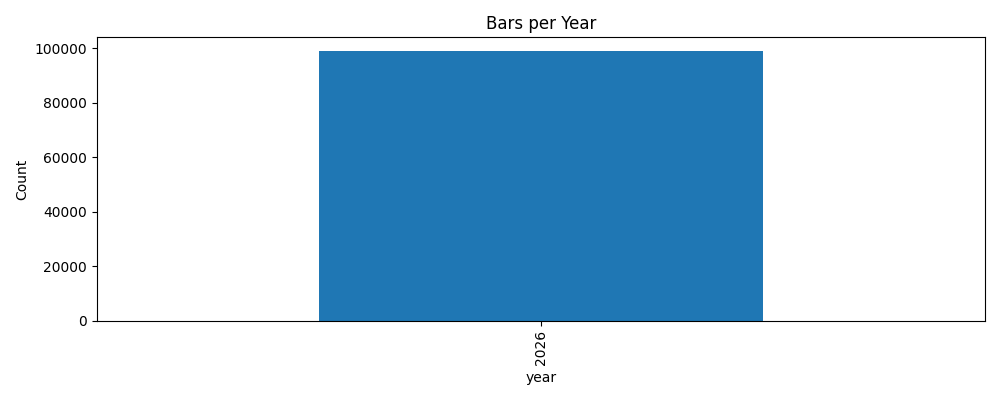
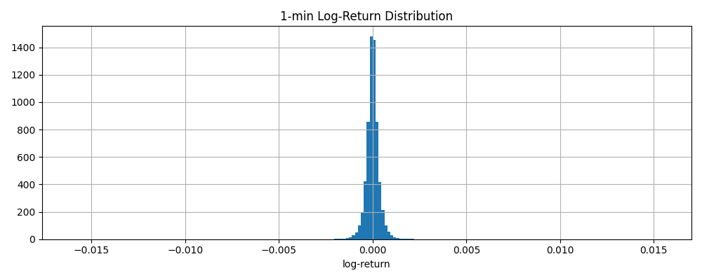

# Data QC Report — TEGF-XAU
**Generated from**: `data/raw/xauusd_1m.csv`
**Total clean bars**: 98,990
**First bar (UTC)**: 2026-06-22 12:32:00+00:00
**Last bar (UTC)**: 2026-09-30 15:46:00+00:00

## Bars per Year
| Year | Bars | Missing-min Rate |
|------|------|------------------|
| 2026 | 98,990 | 72.7% |

## Largest Gaps (top 20, excluding weekends)
| Time | Gap (min) |
|------|----------|
| 2026-07-05 22:01:00+00:00 | 3182 |
| 2026-09-13 22:05:00+00:00 | 2948 |
| 2026-08-16 22:01:00+00:00 | 2944 |
| 2026-09-06 22:01:00+00:00 | 2944 |
| 2026-07-19 22:01:00+00:00 | 2944 |
| 2026-08-30 22:01:00+00:00 | 2944 |
| 2026-08-02 22:01:00+00:00 | 2944 |
| 2026-07-12 22:01:00+00:00 | 2944 |
| 2026-09-20 22:01:00+00:00 | 2944 |
| 2026-07-26 22:01:00+00:00 | 2944 |
| 2026-08-09 22:01:00+00:00 | 2944 |
| 2026-08-23 22:01:00+00:00 | 2944 |
| 2026-06-28 22:01:00+00:00 | 2944 |
| 2026-09-27 22:01:00+00:00 | 2944 |
| 2026-09-07 22:01:00+00:00 | 214 |
| 2026-08-18 22:04:00+00:00 | 67 |
| 2026-08-24 22:00:00+00:00 | 63 |
| 2026-09-02 22:00:00+00:00 | 63 |
| 2026-08-26 22:00:00+00:00 | 63 |
| 2026-08-27 22:00:00+00:00 | 63 |

## Return Distribution by Year
| Year | Mean(r) | Std(r) | Kurtosis(r) |
|------|---------|--------|-------------|
| 2026 | -0.000000 | 0.000379 | 99.43 |

## Top 20 Extreme 1-min Returns
| Time | Open | High | Low | Close | r_close |
|------|------|------|-----|-------|--------|
| 2026-09-04 12:31:00+00:00 | 4403.44 | 4408.04 | 4398.14 | 4401.98 | -0.016069 |
| 2026-07-14 12:31:00+00:00 | 4089.14 | 4096.81 | 4086.02 | 4092.70 | 0.015434 |
| 2026-08-07 12:31:00+00:00 | 4354.18 | 4361.25 | 4348.34 | 4358.32 | 0.011839 |
| 2026-07-02 12:31:00+00:00 | 4118.14 | 4123.56 | 4104.81 | 4110.10 | 0.010966 |
| 2026-07-26 22:01:00+00:00 | 4091.77 | 4092.76 | 4090.24 | 4092.63 | 0.009748 |
| 2026-07-29 18:01:00+00:00 | 4076.27 | 4085.16 | 4070.89 | 4079.47 | 0.008681 |
| 2026-08-12 12:30:00+00:00 | 4426.67 | 4432.72 | 4382.03 | 4393.98 | -0.007519 |
| 2026-08-02 22:01:00+00:00 | 4073.04 | 4074.43 | 4071.79 | 4072.35 | 0.007032 |
| 2026-09-11 12:31:00+00:00 | 4296.83 | 4314.85 | 4295.04 | 4311.89 | -0.006743 |
| 2026-09-04 13:00:00+00:00 | 4393.83 | 4394.78 | 4366.51 | 4366.51 | -0.006189 |
| 2026-07-12 22:01:00+00:00 | 4098.56 | 4099.25 | 4094.51 | 4095.28 | -0.005959 |
| 2026-06-24 12:25:00+00:00 | 4032.99 | 4033.60 | 4008.21 | 4008.96 | -0.005954 |
| 2026-09-04 12:33:00+00:00 | 4383.82 | 4412.80 | 4379.56 | 4408.66 | 0.005640 |
| 2026-06-30 01:07:00+00:00 | 3967.57 | 3967.82 | 3942.10 | 3945.31 | -0.005613 |
| 2026-07-13 14:16:00+00:00 | 4033.44 | 4034.64 | 4009.82 | 4013.32 | -0.005016 |
| 2026-09-16 18:00:00+00:00 | 4360.46 | 4368.17 | 4337.01 | 4338.82 | -0.005006 |
| 2026-09-16 18:01:00+00:00 | 4339.02 | 4340.05 | 4315.45 | 4317.61 | -0.004901 |
| 2026-07-19 22:01:00+00:00 | 4000.13 | 4000.38 | 3997.67 | 3998.50 | -0.004804 |
| 2026-09-09 15:01:00+00:00 | 4428.02 | 4430.97 | 4405.24 | 4407.25 | -0.004688 |
| 2026-07-08 08:17:00+00:00 | 4105.75 | 4107.07 | 4086.77 | 4087.03 | -0.004596 |

## Spread Distribution by Year (price units)
|   year |   count |     mean |      std |   min |   25% |   50% |   75% |   max |
|-------:|--------:|---------:|---------:|------:|------:|------:|------:|------:|
|   2026 |   98990 | 0.249622 | 0.012044 |  0.16 |  0.24 |  0.24 |  0.26 |  0.58 |

## Plots

